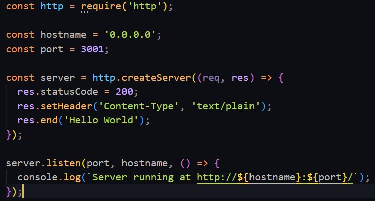
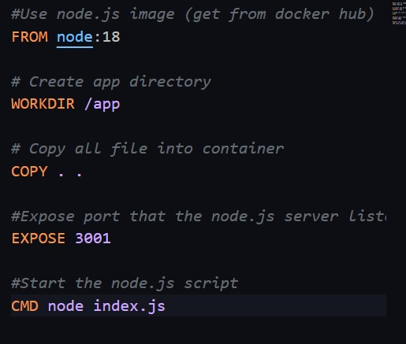
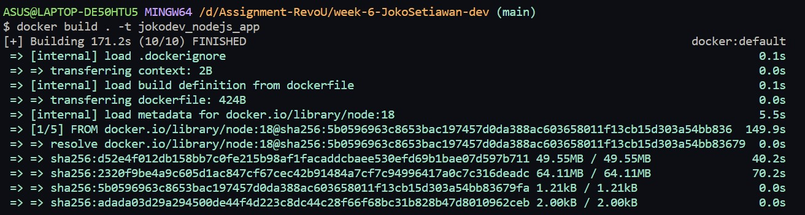
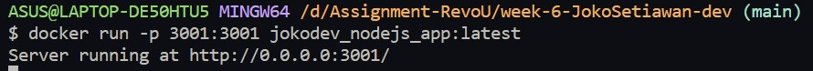

# Run Node JS Using Docker

Hello, everyone. I am Joko Setiawan, and I am a student at FSSE RevoU. This is an assignment given in week 6. In this assignment, I am required to run Node JS using Docker.

This is steps to run Node JS using Docker:

## 1. Install Docker

- Install WSL using command prompt with **wsl --install** command
- Enable the WSL 2 feature on Windows. For detailed instructions, refer to the [Microsoft Documentation](https://docs.microsoft.com/en-us/windows/wsl/install-win10)
- BIOS-level hardware virtualization support must be enabled in the BIOS settings. For more information, see [Virtualization](https://docs.docker.com/desktop/troubleshoot/topics/#virtualization)
- Download and install the Linux kernel update package. For detaile information, see [Linux Update Karnel Guide](https://docs.microsoft.com/windows/wsl/wsl2-kernel)
- Download Docker for dekstop and run **Docker Dekstop Installer.exe**
- Done

## 2. Create Node.JS File

Create a file named index.js and insert Node JS script inside it.

## 3. Create Dockerfile

## 4. Build Docker Image

Go to the directory that has your Dockerfile and run the following command to build the Docker image. The **-t** flag lets you tag your image so it's easier to find later using the docker images command.

## 5. Run Docker Container

To run the Docker container, you can follow this command:

The -p flag is used to link port 3001

## 6. Access The Node.js Server

After running the Docker container, you will receive a message "Server running at http://0.0.0.0:3001/". Next, open a web browser and go to http://localhost:3001/ to access the server.
